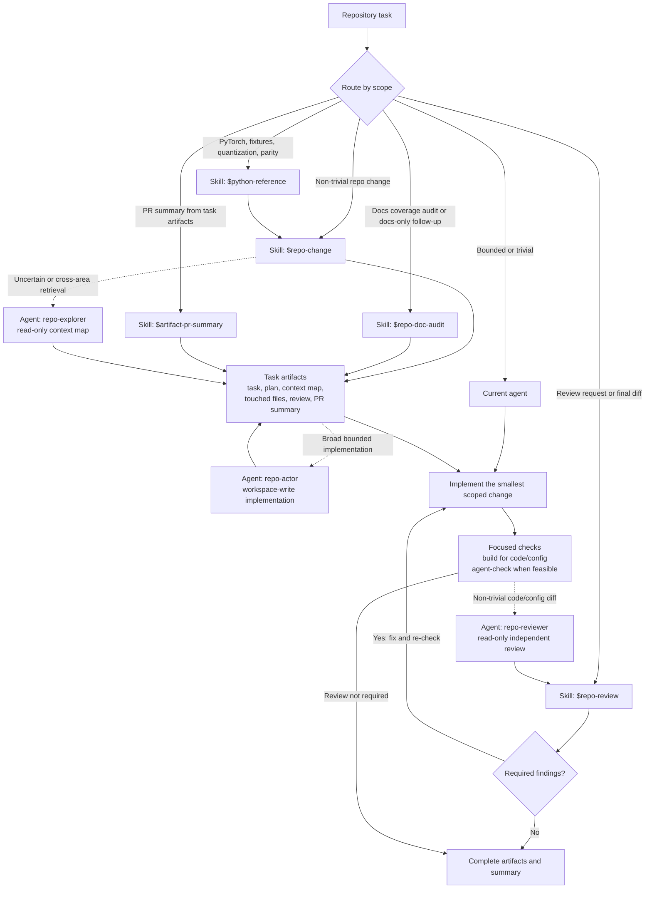

# Web Style Transfer

Browser-native neural style transfer powered by React, TypeScript, Vite, and WebGPU. The app implements the classical Gatys optimization loop: VGG19 weights stay fixed, and the pixels of the output image are optimized to match content features and style Gram matrices.

The codebase keeps a PyTorch reference implementation in `python-reference/` and uses generated fixtures to verify the browser kernels and worker pipelines against deterministic baselines.

## Current state

The browser app is runnable and includes:

- A React UI for content/style image selection, resolution presets, optimizer controls, model-pack selection, progress telemetry, and final image preview.
- A standalone `/pointcloud-preview` route for rendering mesh-aligned point clouds from JSON exports, including fragment-KNN mesh shading, hit inspection, screenshots, and reusable saved viewpoints.
- A Web Worker that owns WebGPU initialization, GPU buffers, shader dispatch, and pipeline execution.
- WebGPU kernels for forward ops, loss ops, manual input-gradient backpropagation, and optimizer updates.
- End-to-end style-transfer execution through VGG19 feature layers up to `conv5_1` / torch `features[28]`.
- Optimizer support for SGD, Adam, and LBFGS-style input updates.
- Manifest-backed VGG19 model packs, IndexedDB model-pack caching, and optional external model-pack hosting.
- A `/benchmark` route for image pipeline kernel-setting speed benchmarks, first-pool benchmarks, and model-pack acceptance checks.

The implementation is still intentionally correctness-first in several kernels. The most important remaining work is performance tuning, browser/device QA, and cleaning up fixture/model-pack generation workflows.

## Repository layout

| Path                                                                   | Purpose                                                                                                    |
| ---------------------------------------------------------------------- | ---------------------------------------------------------------------------------------------------------- |
| `src/App.tsx`                                                          | Main app shell and presentation layer.                                                                     |
| `src/PointCloudPreviewApp.tsx`                                         | Standalone point-cloud mesh preview route shell.                                                           |
| `src/features/style-transfer/`                                         | Main-thread style-transfer controller, model-pack loading, caching, and benchmark helpers.                 |
| `src/features/pointcloud-preview/`                                     | Point-cloud mesh JSON loading, validation, interpolation, and R3F scene rendering.                         |
| `src/styleTransfer.worker.ts`                                          | Worker entrypoint.                                                                                         |
| `src/ml/worker/main-thread-protocol/`                                  | Worker message routing and response helpers.                                                               |
| `src/ml/worker/runtime/`                                               | WebGPU device state, buffer helpers, reusable buffer pool, pipeline cache, and shader execution utilities. |
| `src/ml/worker/ops/`                                                   | WebGPU op implementations for convolution, ReLU, pooling, normalization, Gram matrices, and losses.        |
| `src/ml/worker/pipelines/optimization/`                                | First-pool and full-style-transfer optimization pipelines.                                                 |
| `src/types/worker-protocol/`                                           | Typed worker request/response protocol.                                                                    |
| `tests/`                                                               | Playwright integration and parity tests.                                                                   |
| `python-reference/`                                                    | PyTorch reference scripts and fixture exporters.                                                           |
| `public/vgg19-models/`                                                 | Committed VGG19 model packs used by the app by default.                                                    |
| `public/vgg19-first-pool/`, `public/phase4-backprop/`, `public/lbfgs/` | Smaller committed fixtures.                                                                                |
| `docs/`                                                                | Architecture and implementation-plan notes.                                                                |

## Requirements

- Node.js 22 is used by the GitHub Pages workflow.
- npm dependencies from `package-lock.json`.
- A Chromium-family browser with WebGPU for real browser execution.
- Python dependencies from `requirements.txt` for reference scripts and fixture generation.

## Install and run the web app

```bash
npm ci
npm run dev
```

Then open the Vite URL printed by the dev server.

Build the production bundle:

```bash
npm run build
```

Preview a production build locally:

```bash
npm run preview
```

Run the benchmark UI by visiting `/benchmark` under the dev or preview server.
Run the point-cloud mesh preview UI by visiting `/pointcloud-preview` under the dev or preview server.

The point-cloud preview route boots from the committed medium demo, lets you
upload replacement JSON exports, and provides:

- baked-vertex versus spatial-hash fragment-KNN mesh colouring;
- point visibility, wireframe, point-size, gamma, and brightness controls;
- axis snapping, Y/Z swapping, camera reframing, and saved viewpoints stored in
  browser local storage across datasets on this route, with copyable camera
  position and focal-point details;
- PNG screenshot export of the current canvas view.
- Batch screenshot ZIP export across every queued upload and selected saved
  viewpoint when multiple meshes are loaded.

## Model packs

Runtime model loading resolves model assets from:

1. `VITE_VGG19_MODEL_BASE_URL`, when set; otherwise
2. Vite public assets at `<base>/vgg19-models/...`.

Committed model packs currently include:

- `int8-per-channel`
- `int4log-experimental`

The UI exposes additional pack names (`fp32`, `fp16`, `int8log-per-channel`, `int4-experimental`) because the parser and benchmark tooling support them, but those packs are not all committed by default. If a selected pack is unavailable, the fetch for that pack's manifest or shard will fail.

Model packs are cached in IndexedDB after download. The UI includes cache status and a cache-clear path through the style-transfer controller.

To host packs outside the app bundle, provide a raw asset base URL at build time:

```bash
VITE_VGG19_MODEL_BASE_URL=https://raw.githubusercontent.com/<owner>/<repo>/main/public/vgg19-models npm run build
```

Use raw file URLs, not `github.com/.../blob/...` URLs.

## Python reference

Install Python dependencies:

```bash
pip install -r requirements.txt
```

Run the original reference style-transfer script:

```bash
python python-reference/style-transfer.py
```

This writes experiment outputs under `./expt`.

Important fixture/export scripts:

```bash
python python-reference/export_vgg19_first_pool.py
python python-reference/export_vgg19_phase3_full_pass.py
python python-reference/export_phase4_backprop_fixtures.py
python python-reference/export_lbfgs_fixtures.py
python python-reference/evaluate_vgg19_quantization.py
```

Large generated fixtures and full model packs should not be committed unless the repository already tracks them or the task explicitly requires it.

The point-cloud preview route accepts JSON with the same four arrays as `python-reference/pointcloud-style-transfer/data-storage.py`:

```json
{
  "m_verts": [
    [0, 0, 0],
    [1, 0, 0],
    [0, 1, 0]
  ],
  "m_faces": [[0, 1, 2]],
  "pc_xyz": [
    [0.2, 0.1, 0],
    [0.7, 0.2, 0],
    [0.3, 0.8, 0]
  ],
  "pc_rgb": [
    [1, 0, 0],
    [0, 1, 0],
    [0, 0, 1]
  ]
}
```

`m_verts` and `pc_xyz` must be in the same coordinate space, and `pc_xyz` / `pc_rgb` must have matching lengths.

See [public/pointcloud-style-transfer/README.md](public/pointcloud-style-transfer/README.md)
for the committed preview examples and how they relate to the Python reference
exports.

## Testing

The default test tiers are intentionally small enough to run in pull requests while still making the existing browser coverage visible:

1. **Install and browser setup** installs locked npm dependencies plus Chromium and its system libraries.
2. **Repository checks** run changed-file formatting validation, ESLint, the TypeScript/Vite production build, and the default Playwright suite through `scripts/agent-check.sh`.
3. **Optional benchmarks** remain separate because they measure performance-sensitive `/benchmark` and kernel-lab paths rather than routine correctness.

The pull-request workflow at `.github/workflows/agent-review.yml` and the push-to-main workflow at `.github/workflows/ci.yml` run the same safe checks:

```bash
npm ci
npx playwright install chromium
npx playwright install-deps chromium
./scripts/agent-check.sh
```

Run optional benchmark and kernel-lab specs separately when validating performance-sensitive changes:

```bash
npm run benchmark
```

Use the same commands locally when validating a branch from a clean checkout. For day-to-day work after dependencies and browsers are installed, the most common local commands are:

```bash
npm run dev
npm run build
npm test
```

Some Playwright specs skip automatically when optional large generated weights or optional full model packs are absent. The default tier uses committed fixtures and model packs: first-pool, phase-4 backprop, LBFGS, the compact phase-3/full-style-transfer fixture, and the committed `int8-per-channel` model pack. Tests that can use either exact legacy fp32 weights or a manifest-backed pack choose the legacy fp32 JSON when it is present, then a local `fp32` pack, and finally the committed `int8-per-channel` pack with looser quantized-weight tolerances.

CI intentionally does **not** generate VGG19 assets in the default pull-request job. Generating all phase-3/full-style-transfer outputs requires Python/PyTorch setup plus the pretrained VGG19 download, which is roughly 500 MB before generated outputs. The large legacy fp32 weights JSON remains uncommitted because it adds roughly 70 MB of rarely edited test data to normal clones; use the committed compact fixture plus `int8-per-channel` pack for PR coverage instead.

To opt into exact legacy-fp32 full-pass tests locally, generate the legacy weights first, then run `npm test` again:

```bash
python python-reference/export_vgg19_phase3_full_pass.py
npm test
```

Do not commit generated large legacy weights or model packs unless they were already tracked or a task explicitly asks for them.

Always run the production build before concluding code changes:

```bash
npm run build
```

Optional checks:

```bash
npm run lint
npm run format:check
```

Prettier excludes generated fixture and model-pack JSON under `public/` so
exporter output remains compact. Untracked model-pack shard binaries are also
ignored by Git.

## Agent workflow

`AGENTS.md` is intentionally compact because it is loaded for every task.
Detailed procedures use repo-local Codex skills, so their full instructions are
loaded only when relevant:

- `$repo-change`: staged workflow for non-trivial repository changes.
- `$repo-doc-audit`: documentation-coverage audit for an existing diff or
  branch, with narrow doc-only follow-up updates.
- `$artifact-pr-summary`: synthesize prior task artifacts into a branch-level PR
  description.
- `$python-reference`: PyTorch exporters, fixtures, quantization, and parity.
- `$repo-review`: independent final-diff review.

The diagram below is the human-facing map of the workflow. Skills provide
task-specific instructions; project agents are fresh-context roles that may be
delegated bounded work. Task artifacts are the durable handoff between them.

<!-- agent-workflow-diagram:start -->



<!-- agent-workflow-diagram:end -->

When adding, removing, renaming, or materially rerouting a repo skill or project
agent, update this marked diagram in the same change.

For a non-trivial change, use a short task ID:

```bash
./scripts/agent-task.sh init improve-cache-errors
```

The task state lives under `.agent-artifacts/improve-cache-errors/` and is
ignored by Git. Complete the task, plan, context map, touched-file list, review,
and PR summary there. Draft the final scope from the diff with:

```bash
./scripts/agent-pr-summary.sh --task improve-cache-errors origin/main
```

After checks and review, validate that the artifacts are complete and cover
every changed file:

```bash
./scripts/agent-task.sh check improve-cache-errors origin/main
```

The legacy `./scripts/agent-pr-summary.sh [base-ref]` form still writes flat
artifacts for compatibility, but task-scoped mode is recommended.

Project-scoped agents live in `.codex/agents/`:

- `repo-explorer` handles broad or uncertain retrieval and returns a compact
  context map.
- `repo-actor` implements a bounded plan from task artifacts without inheriting
  raw exploration history.
- `repo-reviewer` independently reviews final non-trivial code/config diffs.

Use one agent for bounded work. Delegate read-heavy exploration or independent
review when it meaningfully reduces context pollution; avoid overlapping
writers.

`./scripts/agent-check.sh` validates the tracked harness, changed-file
formatting, lint, build, and the default Playwright suite without installing or
changing dependencies. Set `AGENT_FULL_FORMAT_CHECK=1` for the repository-wide
Prettier check. Set `AGENT_TASK_ID=<task-id>` to include local artifact
validation in the same command.

Policy and navigation references:

- `docs/architecture.md`
- `docs/code-map.md`
- `docs/change-policy.md`
- `docs/review-rubric.md`

## Deployment to GitHub Pages

The workflow at `.github/workflows/deploy-pages.yml` builds on pushes to `main` and publishes the `dist/` artifact through GitHub Pages.

Repository setup:

1. Open **Settings → Pages** in GitHub.
2. Set **Build and deployment → Source** to **GitHub Actions**.
3. Push to `main` or run the workflow manually.

The workflow sets `BASE_PATH=/${{ github.event.repository.name }}/`, so Vite emits URLs that work under `https://<owner>.github.io/<repo>/`.

If model packs become too large for the Pages artifact, host them separately and set `VITE_VGG19_MODEL_BASE_URL` in the workflow's build step.

## More documentation

- `docs/architecture-overview.md` explains current module responsibilities and data flow.
- `docs/webgpu-style-transfer-plan.md` describes the implementation plan, phase status, and remaining follow-ups.
- `public/vgg19-models/README.md` documents the model-pack layout and manifest schema.
- `python-reference/vgg19-phase3-full-pass-README.md` documents the large phase-3 fixture exporter.
